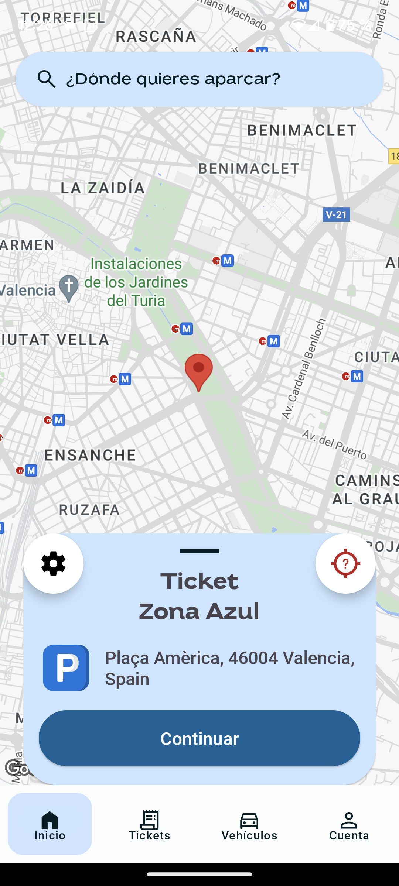
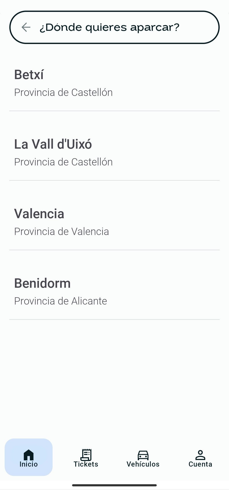
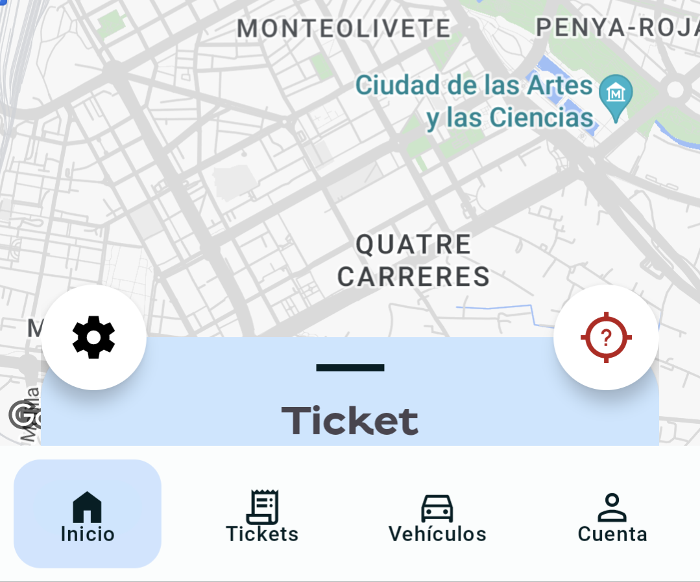
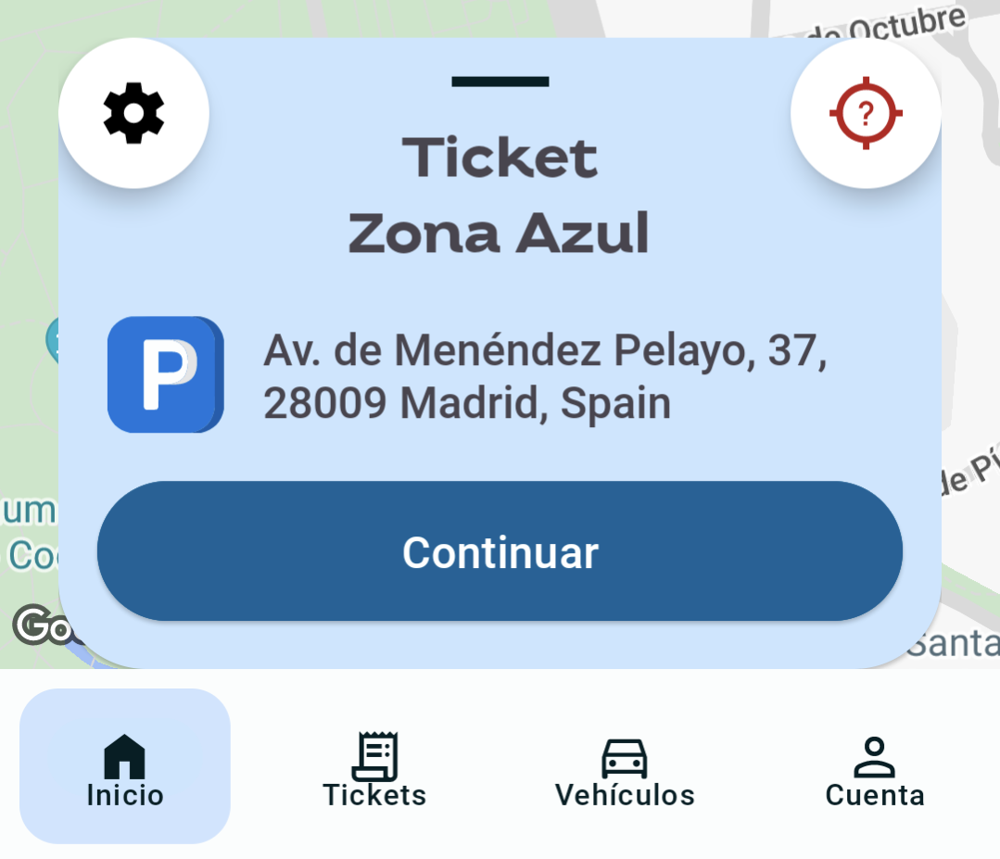
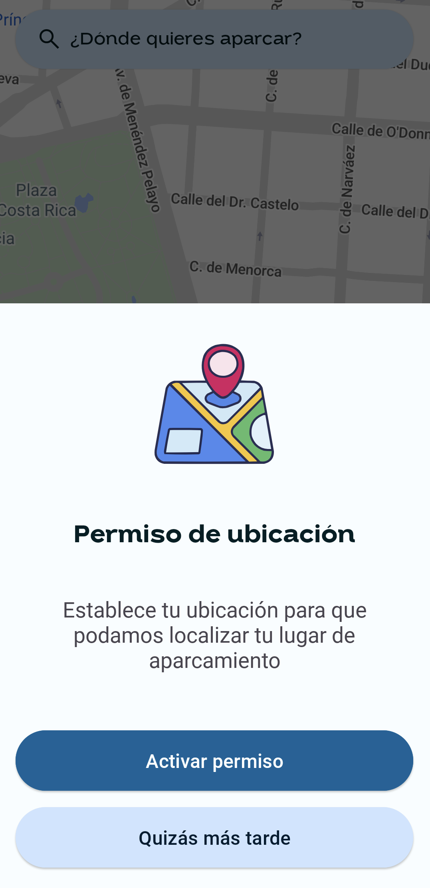
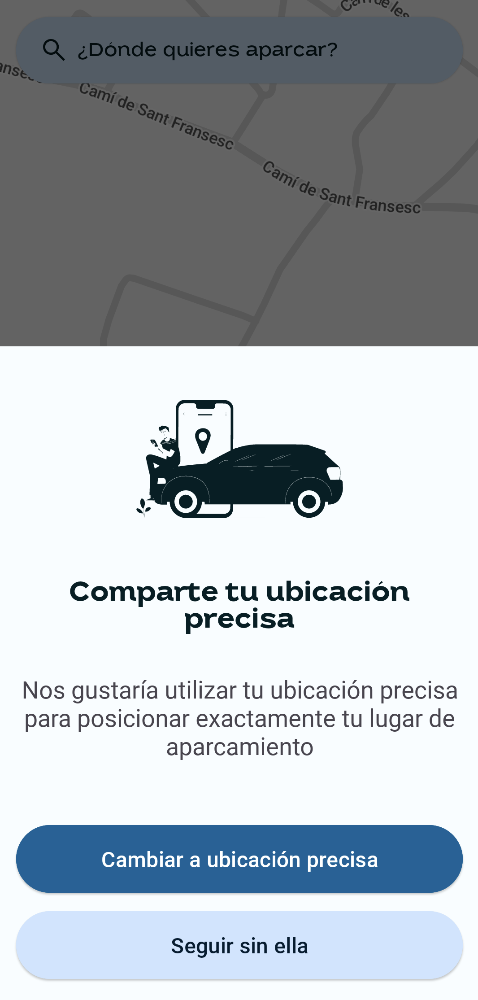

# ZonaBlava

*Get your parking ticket effortlessly*

## Introduction

This project is the result of my thesis work during my higher education studies, specifically the Higher Professional Training Program of 2 years. The project's initial phase, including the thesis documentation, was completed and submitted in June 2023. However, the development of the application has continued beyond the scope of the thesis, with ongoing enhancements and updates. Feel free to check the [PDF](https://drive.google.com/file/d/1rUUOyTHoGvRlYACSCU2s2tGlRVlB27Eh/view?usp=sharing) of the thesis. 

## About

ZonaBlava is a cutting-edge Android application developed to revolutionize the way regulated parking is managed. With ZonaBlava, users can effortlessly obtain virtual parking tickets directly from their mobile devices, eliminating the hassle of searching for physical parking meters. Our app offers a seamless and convenient solution for a smoother parking experience. Say goodbye to the traditional complexities of parking management and embrace the simplicity and efficiency of ZonaBlava. :parking: :ticket:

## Current app state

Under construction 🚧

## Screenshots

|  |  |
|:------------------------------------:|:-----------------------------:|
| Home Screen                           | Search Screen                   |

|  |  |
|:------------------------------------:|:-----------------------------:|
| Park Car Bottom Sheet Collapsed                           | Park Car Bottom Sheet Expanded                   |

|  |  |
|:------------------------------------:|:-----------------------------:|
| Location permission rationale                           | Change to fine location rationale                  |

<!-- Features, Getting Started, Version History (v1.0 -->
